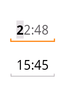

TimeTextView
==============

 A custom EditText (actually derived from TextView) to input time in 24h format.    
 
 Features:   
 - It always shows the currently set time, so it's never empty.    
 - Both virtual and physical keyboards can be used.   
 - The current digit is highlighted; when a number on the keyboard is pressed, the digit is replaced.   
 - Back key moves the cursor backward.   
 - Space key moves the cursor forward.   